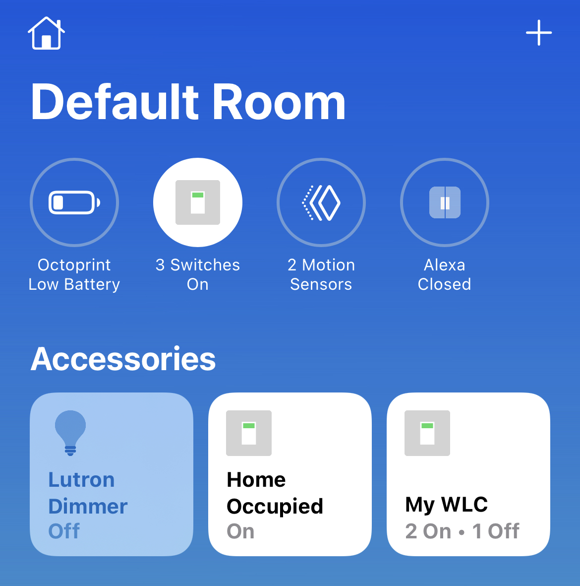

# A [Cisco](https://www.cisco.com) Wireless LAN Controller plugin for [Homebridge](https://github.com/nfarina/homebridge).  

This creates a Light Switch in homekit for the status of an SSID using RESTCONF.

This was tested to work with the Cisco Catalyst 9800CL. It should work with any other model of Cisco Catalyst 9800.

# Installation
Run these commands:

    sudo npm install -g homebridge
    sudo npm install -g homebridge-c9800

NOTE: If you install homebridge like this:

    sudo npm install -g --unsafe-perm homebridge

Then all subsequent installations must be like this:

    sudo npm install -g --unsafe-perm homebridge-c9800

# Configuration
Example accessory config (needs to be added to the homebridge config.json):
 ...

		"accessories": [
			{
				"name": "Guest WiFi",
				"ipAddress": "192.168.1.115",
				"username": "admin",
				"password": "password",
				"wlanName": "guest",
				"model": "C9800CL",
				"serial": "myserialno",
				"timeout": 10000,
				"debug": false,
				"accessory": "Cisco 9800"
			}
		]
 ...

### Config Explanation:

Field           						| Description
----------------------------|------------
**accessory**   						| (required) Must always be "Cisco 9800".
**name**										| (required) The name you want to use for the light switch widget.
**ipAddress**								| (required) The IP address of the WLC (should be static, not DHCP).
**username**								| (required) The username used to access the WLC.
**password**								| (required) The password used to access the WLC.
**wlanName**								| (required) The WLAN Name associated with the SSID on the WLC.
**model**										| (optional) This shows up in the homekit accessory Characteristics.
**serial**									| (optional) This shows up in the homekit accessory Characteristics.
**timeout**									| (optional) The timeout duration in ms for the web API calls.
**debug**										| (optional) Enables additional logging.

To make your WLC work with the plugin:

1. Connect your WLC to your network.
2. Configure your WLC.
3. Enable restconf on the WLC.
4. Write down the IP address of the WLC.
5. Create your config file according to the above example (or using the Homebridge UI).

# More information
Check out https://github.com/nfarina/homebridge for more information about Homebridge.

